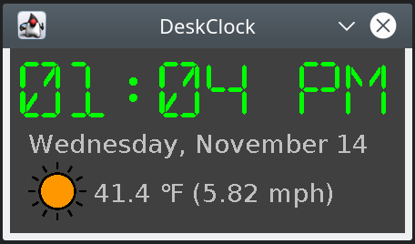

# DeskClock

A simple desktop clock (and weather) application.

Icons made by [Pixel perfect](https://www.flaticon.com/authors/pixel-perfect) from [www.flaticon.com](https://www.flaticon.com/
is licensed by [CC 3.0 BY](http://creativecommons.org/licenses/by/3.0/).

Weather information comes from https://openweathermap.org/api. 

## Usage

You will need an API key for the OpenWeatherMap API.

    java -jar deskclock.jar <zip-code> <api-key>

